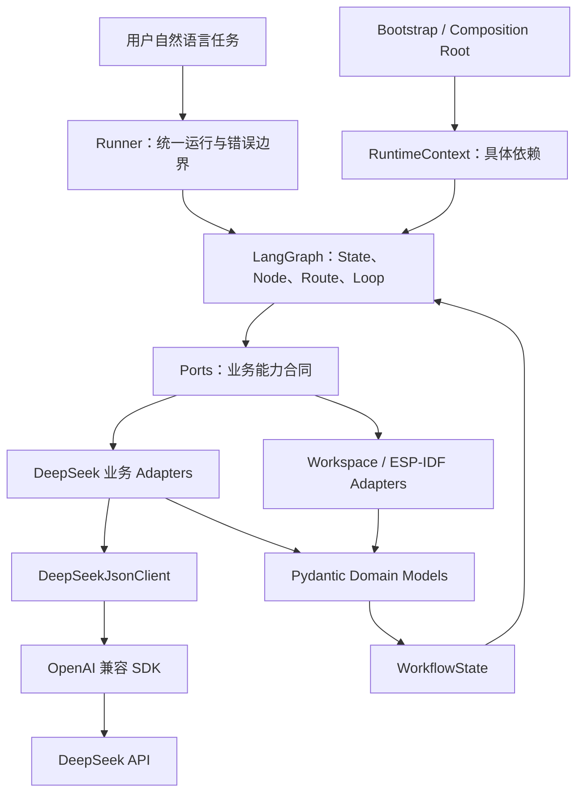

# LUXAR Agent 开发复习总览

这份文档是当前 LUXAR 学习阶段的总复习入口。它不要求你记住所有代码，而是帮助你重新建立三张地图：

1. 名词地图：英文术语到底是什么意思；
2. 语法地图：Python 写法来自哪里、运行时做什么；
3. 架构地图：自然语言如何经过 Agent、LangGraph、模型和工程工具变成最终结果。

当前检查点：DeepSeek 模型 Adapter、七节点 LangGraph、证据驱动修复循环、组合根和统一模型错误边界已经完成。最近一次完整离线验证为 `130 passed, 1 skipped`；跳过的是没有获得联网授权的真实 DeepSeek Smoke Test。

## 一、先记住这句话

当前 LUXAR 可以看成一个“有模型参与决策和转换的受约束状态机”。

- LangGraph 管理状态、节点、路线和循环。
- DeepSeek 负责把不确定的自然语言转换成结构化候选结果。
- Pydantic 和 Domain Model 判断候选结果是否合法。
- ESP-IDF、Workspace 等工程工具提供真实世界证据和文件副作用。
- Port 隔离业务代码与具体工具。
- Runner 在最外层统一处理模型能力异常。

LLM 不是整个 Agent。LLM 是 Agent 工作流中的一种能力；真正的 Agent 还包括状态、工具、约束、路线、重试、证据、安全边界和错误处理。

## 二、英文名词与中文含义

| 英文名词 | 中文名称 | 通俗理解 | LUXAR 中的位置 |
|---|---|---|---|
| Agent | 智能体 | 为一个目标持续读取状态、选择动作、调用能力并检查结果的完整系统 | 整个 `luxar` 包 |
| Workflow | 工作流 | 任务从开始到结束的步骤和规则 | `application/graph.py` |
| State Machine | 状态机 | 根据当前状态决定下一步去哪 | Graph、节点和路由的组合 |
| Domain | 领域层 | 描述 LUXAR 业务事实和不变量 | `src/luxar/domain/` |
| Domain Model | 领域模型 | 经过业务验证的数据对象 | `FirmwareRequirement`、`ExecutionPlan`、`BuildEvidence` |
| Application | 应用层 | 编排一次业务用例，不关心具体供应商 | `src/luxar/application/` |
| Port | 端口、能力接口 | 应用需要什么能力的合同 | `src/luxar/ports/` |
| Adapter | 适配器 | 用某种具体技术实现 Port | `adapters/deepseek/`、Fake Adapters |
| Client | 客户端 | 封装一次外部服务通信 | `DeepSeekJsonClient` |
| SDK | 软件开发工具包 | 第三方提供的调用库 | `openai` Python 包，指向 DeepSeek API |
| State | 状态 | 一次任务运行过程中逐步积累的业务数据 | `WorkflowState` |
| Runtime Context | 运行时上下文 | 本次任务可以使用哪些外部能力 | `RuntimeContext` |
| Runtime | 运行时包装对象 | LangGraph 调用节点时提供的对象，里面含 Context | `Runtime[RuntimeContext]` |
| Node | 节点 | 工作流中的一个动作函数 | `application/nodes.py` |
| Edge | 边 | 节点之间的连接 | `builder.add_edge(...)` |
| Route / Router | 路由 / 路由函数 | 根据最新 State 选择下一节点 | `application/routing.py` |
| Graph | 图、工作流图 | 节点和边组成的可执行工作流 | `build_graph()` |
| Bootstrap | 启动装配 | 创建并连接正式运行所需对象 | `bootstrap.py` |
| Composition Root | 组合根 | 整个应用集中选择具体实现的地方 | `build_deepseek_runtime_context()` |
| Runner | 运行入口 | 执行 Graph，并把异常收口成最终 State | `run_workflow()` |
| Dependency Injection | 依赖注入 | 从外部把需要的对象传进来，而不是类内部写死 | `RuntimeContext` 和构造函数参数 |
| Protocol | 协议、结构化接口 | 只要方法签名相同就满足合同，不要求继承 | `RequirementParser(Protocol)` |
| Fake | 测试替身 | 返回预设结果、记录调用、不访问真实外部系统 | `FakePlanner`、`FakeEspIdf` 等 |
| Evidence | 证据 | 工具真实执行后产生、可检查的事实 | `BuildEvidence` |
| Diagnostic | 诊断 | 编译错误的文件、行列、严重性和消息 | `BuildDiagnostic` |
| Repair Plan | 修复计划 | 模型提出的完整文件替换方案 | `RepairPlan` |
| Structured Output | 结构化输出 | 模型按固定 JSON 结构返回结果 | 三个 DeepSeek 业务 Adapter |
| JSON Schema | JSON 结构说明 | 告诉模型字段、类型和约束 | `model_json_schema()` |
| Validation | 验证 | 检查输入是否满足类型和业务规则 | Pydantic Domain Model |
| Invariant | 不变量 | 对象在任何时候都必须成立的规则 | 路径安全、证据一致性、非空计划 |
| Error Boundary | 错误边界 | 集中把底层异常转换成稳定业务错误 | `application/runner.py` |
| Capability Error | 能力错误 | 外部能力调用失败的稳定异常 | `ports/errors.py` |
| Workflow Error | 工作流错误 | 可以写入 State、展示和恢复的业务错误 | `domain/errors.py` |
| Unit Test | 单元测试 | 单独验证一个函数或类 | `tests/domain/`、`tests/application/test_nodes.py` |
| Contract Test | 合同测试 | 验证实现是否遵守 Port 行为 | `tests/adapters/test_fake_contracts.py` |
| Integration Test | 集成测试 | 多层一起运行，验证纵向链路 | `tests/integration/test_fake_vertical_slice.py` |
| Smoke Test | 冒烟测试 | 用最小真实调用验证外部系统能接通 | `tests/smoke/test_deepseek_requirement_parser.py` |
| Checkpoint | 检查点、持久化快照 | 保存 Graph 运行位置以便恢复 | LangGraph 能力；当前生产持久化尚未实现 |

## 三、最容易混淆的职责边界

### Port、Adapter、Client

```text
Port：应用要求“你必须会做什么”
Adapter：使用某种技术完成这件事
Client：负责和外部服务通信
```

以需求解析为例：

```text
RequirementParser Port
  定义 parse(task_text) -> FirmwareRequirement

DeepSeekRequirementParser Adapter
  编写 Prompt、选择模型、调用 Client、验证 Domain

DeepSeekJsonClient
  调用 OpenAI 兼容 SDK、解析 JSON、转换 SDK 异常
```

Client 不理解 `FirmwareRequirement`。Port 不知道 DeepSeek。Adapter 站在中间，把供应商返回值转换成 LUXAR 业务对象。

### State 与 Runtime Context

```text
State：这次任务已经发生了什么
Context：这次任务可以找谁做事
```

State 可以包含 Requirement、Plan、Evidence、错误和尝试次数。Context 包含 Parser、Planner、ESP-IDF、Workspace 和项目路径。

API Client、密钥和文件工具不应该进入 State，否则可能被 checkpoint、日志或接口响应持久化。

### CapabilityError 与 WorkflowError

```text
CapabilityError：外部能力层事实
WorkflowError：工作流层的安全表达
```

例如 DeepSeek SDK 超时先变成：

```text
CapabilityError(category="timeout", retryable=True)
```

Runner 再把它转换成包含固定安全文字的 `WorkflowError`。原始 SDK 错误和响应内容不会进入 State。

### ExecutionPlan、RepairPlan、BuildEvidence

- `ExecutionPlan` 是“准备做什么”。
- `RepairPlan` 是“建议怎样修改文件”。
- `BuildEvidence` 是“工具实际运行后发生了什么”。

模型可以生成前两者，但不能生成可信的 `BuildEvidence`。只有真实构建工具才能证明编译成功。

## 四、整体分层架构



依赖方向的关键规则：

```text
Application → Port → Domain
Adapter → Port + Domain
Bootstrap → 所有具体实现
Domain 不依赖 LangGraph、DeepSeek、SDK 或文件系统
```

### 当前目录结构

```text
src/luxar/
├─ domain/            业务数据和不变量
├─ ports/             外部能力合同
├─ adapters/          Fake 和 DeepSeek 具体实现
├─ application/       State、Context、节点、路由、Graph、Runner
└─ bootstrap.py       正式依赖装配
```

## 五、四条纵向调用链

### 1. 正常完成链路

```text
task_text
→ run_workflow
→ analyze_requirement
→ RuntimeContext.requirement_parser
→ DeepSeekRequirementParser
→ DeepSeekJsonClient
→ DeepSeek API 返回 JSON
→ FirmwareRequirement.model_validate
→ requirement 写入 State
→ route_after_requirement
→ create_plan
→ DeepSeekPlanner
→ ExecutionPlan 写入 State
→ build_project
→ EspIdfPort 返回 BuildEvidence(success=True)
→ route_after_build
→ completed
```

自然语言主要出现在需求解析和模型规划阶段。路由读取的是结构化 Domain 对象，不直接搜索“ESP32”“GPIO”等字符串。

### 2. 需求不完整链路

```text
自然语言
→ FirmwareRequirement(missing_fields=[...])
→ requirement.is_complete == False
→ request_clarification
→ status="needs_clarification"
```

当前切片在澄清节点结束，尚未实现带 checkpoint 的多轮恢复。

### 3. 构建失败和修复链路

```text
build_project
→ BuildEvidence(success=False, error_category="source")
→ route_after_build
→ repair_project
→ WorkspacePort.read_project_files
→ DeepSeekRepairPlanner(requirement, plan, evidence, files)
→ RepairPlan.model_validate
→ WorkspacePort.apply_repair
→ build_project 再次构建
→ 新 BuildEvidence 决定成功、继续或失败
```

模型提出修复不等于修复成功。必须重新构建，用新证据证明结果。

### 4. 模型能力异常链路

```text
SDK / JSON / Schema 失败
→ CapabilityError
→ 异常穿过当前节点
→ run_workflow 唯一的 except CapabilityError
→ capability_error_to_workflow_error
→ 固定安全 message 和 suggestion
→ 保留 latest_state
→ 返回 status="failed"
```

Runner 使用 `graph.stream(stream_mode="values")` 保存每个成功节点后的完整 State，所以计划失败可以保留 Requirement，修复失败可以保留 Plan 和 BuildEvidence。

## 六、Agent 开发中要掌握的 Python 语法

### 1. `from __future__ import annotations`

它不是第三方包；`__future__` 是 Python 自带的特殊模块。

这句让类型标注延迟处理，类可以在自己的方法返回类型中写自己的名字：

```python
class BuildEvidence(BaseModel):
    @model_validator(mode="after")
    def validate_result_consistency(self) -> BuildEvidence:
        return self
```

没有它时，某些 Python 版本中类体尚未创建完成，直接引用 `BuildEvidence` 会有问题。

### 2. 类型标注不等于默认值

```python
target: str
gpio: int | None = None
```

- `target: str` 只规定类型，没有默认值，创建对象时必须提供。
- `gpio: int | None = None` 允许整数或 `None`，并把 `None` 设为默认值。

普通 Python 类的标注通常主要帮助编辑器；Pydantic `BaseModel` 会在运行时读取标注并验证输入。

### 3. 普通类、BaseModel、Protocol、TypedDict、dataclass

它们都可以称为“类”，但用途不同。

| 写法 | 主要用途 | 运行时对象 | LUXAR 示例 |
|---|---|---|---|
| 普通 `class` | 保存行为和内部状态 | 普通实例 | `FakeRequirementParser` |
| `class X(BaseModel)` | 数据模型和运行时验证 | Pydantic 对象 | `FirmwareRequirement` |
| `class X(Protocol)` | 声明方法合同 | 通常不直接实例化 | `RequirementParser` |
| `class X(TypedDict)` | 描述字典键和值类型 | 运行时仍是 `dict` | `WorkflowState` |
| `@dataclass` | 自动生成初始化等样板代码 | dataclass 实例 | `RuntimeContext` |

### 4. `Literal`

```python
platform: Literal["espidf"] = "espidf"
```

它表示字段只能使用列出的固定值。配合 Pydantic 时不仅是编辑器提示，还会在运行时拒绝其他值。

路由返回类型也使用 `Literal`：

```python
def route_after_requirement(
    state: WorkflowState,
) -> Literal["create_plan", "request_clarification"]:
```

这告诉维护者：函数只能选择这两个合法目的地。

### 5. `Field`、约束和安全默认值

```python
line: int | None = Field(default=None, ge=1)
steps: list[PlanStep] = Field(min_length=1)
missing_fields: list[str] = Field(default_factory=list)
```

- `ge=1`：大于或等于 1。
- `min_length=1`：列表或字符串至少有一项/一个字符。
- `default_factory=list`：每次创建对象时创建新列表，避免多个对象共享同一可变列表。

### 6. 装饰器：`@property`、`@field_validator`、`@model_validator`

`@property` 把方法变成像字段一样的只读计算值：

```python
requirement.is_complete
```

`@field_validator("path")` 检查单个字段，并可返回规范化后的新值。

`@model_validator(mode="after")` 在全部字段分别通过验证之后，检查字段之间的关系。例如成功构建必须同时满足 `return_code == 0` 且没有错误类别。

`after` 验证器最后必须返回 `self`，表示验证后的当前对象。

### 7. `Protocol` 和省略号 `...`

```python
class RequirementParser(Protocol):
    def parse(self, task_text: str) -> FirmwareRequirement:
        ...
```

这里的 `...` 表示只声明合同，不实现行为。一个类只要拥有兼容的 `parse()` 方法，就可以被当作 `RequirementParser`，不必写继承。

### 8. `TypedDict, total=False`

```python
class WorkflowState(TypedDict, total=False):
    task_text: str
    requirement: FirmwareRequirement
```

`WorkflowState` 在运行时仍是普通字典。`total=False` 表示这些键不要求一开始全部存在，节点可以逐步补充。

### 9. `@dataclass(frozen=True)`

```python
@dataclass(frozen=True)
class RuntimeContext:
    planner: Planner
```

`dataclass` 自动生成构造函数。`frozen=True` 防止运行过程中重新给字段赋值，但字段指向的 Adapter 对象仍然可以执行方法和记录内部调用。

### 10. `self` 与 `__init__`

```python
class FakeRequirementParser:
    def __init__(self, requirement: FirmwareRequirement) -> None:
        self.requirement = requirement
        self.calls: list[str] = []
```

- `__init__` 在创建对象时执行。
- `self` 表示当前对象。
- `self.requirement` 把传入值保存在对象中。
- `self.calls` 是每个对象独立拥有的调用记录。

### 11. 泛型：`Runtime[RuntimeContext]`

```python
runtime: Runtime[RuntimeContext]
```

可以从外向内读：

```text
runtime 是 Runtime 对象
这个 Runtime 内部 context 的类型是 RuntimeContext
```

所以：

```python
runtime.context.requirement_parser.parse(state["task_text"])
```

可拆成：

```python
context = runtime.context
parser = context.requirement_parser
task_text = state["task_text"]
requirement = parser.parse(task_text)
```

这条属性链不是 Runtime 自带全部功能。Runtime 只提供 `.context`；`requirement_parser` 来自我们定义的 `RuntimeContext`；`parse()` 来自 `RequirementParser` Port。

### 12. 仅限关键字参数的 `*`

```python
def build_deepseek_runtime_context(
    *,
    espidf: EspIdfPort,
    workspace: WorkspacePort,
    project_path: Path,
) -> RuntimeContext:
```

单独的 `*` 表示后面的参数调用时必须写名字：

```python
build_deepseek_runtime_context(
    espidf=espidf,
    workspace=workspace,
    project_path=path,
)
```

企业项目参数较多时，这能防止按错误顺序传值。

### 13. 列表和字典解包

列表解包：

```python
trace = [
    *state.get("trace", []),
    "create_plan",
]
```

它创建新列表，把旧 trace 展开后追加新节点名，不原地修改输入。

字典解包：

```python
{
    **latest_state,
    "error": workflow_error,
    **failure_update,
}
```

同名键以后面的值为准，因此最后的 `failure_update` 可以可靠写入失败状态和 trace。

### 14. 列表推导

```python
paths = [
    replacement.path
    for replacement in self.replacements
]
```

它等价于创建空列表后循环追加，用来从一组对象提取字段。

### 15. 生成器与 `stream()`

```python
for snapshot in graph.stream(...):
    latest_state = snapshot
```

`stream()` 不会一次性返回所有结果，而是在工作流推进时逐步产生值。真正的节点执行和异常也发生在循环取下一项时，所以 `try` 必须包住整个 `for`。

### 16. `try/except` 与 `raise ... from`

```python
try:
    return FirmwareRequirement.model_validate(payload)
except ValidationError as error:
    raise CapabilityError(...) from error
```

外层得到稳定的 `CapabilityError`，`from error` 同时保留内部异常因果链，便于测试和调试。对用户展示时仍使用脱敏后的固定消息。

### 17. `cast`

```python
latest_state = cast(WorkflowState, snapshot)
```

`cast` 只告诉类型检查器“把它当作这个类型理解”，不会复制、转换或验证运行时对象。真正的数据验证应由 Pydantic 或明确逻辑完成。

### 18. Pydantic 常用方法

| 方法 | 用途 |
|---|---|
| `model_validate(data)` | 把字典验证为 Domain 对象 |
| `model_dump(mode="json")` | 把 Domain 对象转换成适合 JSON 的普通数据 |
| `model_json_schema()` | 生成字段和约束的 JSON Schema |

典型闭环：

```text
Domain Schema 放入 Prompt
→ 模型返回 JSON 字典
→ model_validate 再次验证
→ 合法 Domain 对象进入 State
```

## 七、代码如何在没有 `main()` 时真正运行

Python 文件中的 `class` 和 `def` 主要是在定义类和函数；定义本身通常不会执行函数体。

pytest 会：

1. 寻找 `tests/` 下符合命名规则的测试文件；
2. 导入测试模块；
3. 找到 `test_` 开头的函数；
4. 调用这些测试函数；
5. 测试函数再创建对象、调用节点、执行 Graph 并断言结果。

例如 Runner 集成测试会真正调用：

```text
test_runner_...
→ run_workflow()
→ build_graph().stream()
→ 节点函数
→ Fake Port 或抛错 Port
→ 返回 State
→ assert 检查结果
```

所以“pytest 通过”表示测试实际覆盖的行为符合断言，不只是语法正确。语法错误会让测试在导入或收集阶段直接报错，但没有语法错误也不代表业务正确。

## 八、测试类型怎么区分

| 测试类型 | 回答的问题 | 当前例子 |
|---|---|---|
| Domain 单元测试 | 单个业务对象的不变量是否正确 | 路径、Evidence、Requirement 测试 |
| Node 单元测试 | 节点是否正确读取 State/Context 并返回更新 | `test_nodes.py` |
| Route 单元测试 | 给定结构化 State 会选择哪个节点 | `test_routing.py` |
| Contract Test | Fake 或 Adapter 是否遵守 Port 合同 | `test_fake_contracts.py` |
| Client Test | HTTP/SDK 包装和异常映射是否正确 | `test_client.py` |
| Topology Test | Graph 节点和边是否正确 | `test_graph.py` |
| Integration Test | 多层纵向链路是否能一起工作 | `test_fake_vertical_slice.py` |
| Smoke Test | 最小真实外部调用是否能接通 | DeepSeek requirement smoke |

默认测试使用 Fake，不访问网络、不写真实工程、不运行 `idf.py`。这让测试快速、稳定、可重复。

## 九、Agent 工程必须注意的原则

### 1. Prompt 不是安全边界

Prompt 可以告诉模型“禁止绝对路径”，但模型可能违反。`RepairPlan` 的路径验证会再次拒绝绝对路径和 `..`。未来真实 Workspace Adapter 写文件前还要解析最终路径并确认它仍在项目根目录下。

```text
Prompt 约束
→ Domain 验证
→ Adapter 写入前检查
```

这是多层防御，不是重复浪费。

### 2. 模型建议与工具事实必须分开

模型可以说“我修好了”，但系统不能相信。必须运行构建工具并生成新的 `BuildEvidence`。

### 3. 路由尽量读取结构化数据

自然语言先转成 `FirmwareRequirement`。后续路线读取 `is_complete`、`error_category` 和尝试次数，不反复让模型猜下一步。

### 4. 循环必须有预算

`attempts` 和 `max_attempts` 防止构建/修复无限循环。成功判断优先于预算耗尽判断，保证最后一次尝试成功时仍能完成。

### 5. 外部依赖不能写死在节点里

节点通过 Port 和 Runtime Context 使用能力。测试注入 Fake，正式运行注入 DeepSeek 或工程 Adapter，Graph 不需要改变。

### 6. 错误要归一化并脱敏

SDK 异常先转换成供应商无关的 `CapabilityError`，Runner 再转换成可进入 State 的 `WorkflowError`。API 密钥、原始响应和底层异常文本不进入 State。

### 7. 数据进入 State 前必须验证

合法 JSON 不等于合法业务数据。每个模型结果都必须通过对应 Domain Model 的 `model_validate()`。

### 8. 文件副作用必须有唯一负责人

RepairPlanner 只能提出 `RepairPlan`，不能直接拿文件系统句柄。只有 Workspace Adapter 可以读取和写入受限工程目录。

## 十、常见误解纠正

### “Agent 就是 LLM”

错误。LLM 只是能力之一。Agent 还需要状态、工具、路线、循环、错误边界、证据和安全规则。

### “LangGraph 自动理解自然语言并选择节点”

不准确。当前 LUXAR 先用 DeepSeek Adapter 把自然语言转换成 `FirmwareRequirement`；LangGraph 路由读取验证后的字段决定下一节点。

### “类型标注会自动创建默认值”

错误。`name: str` 没有默认值；只有 `name: str = "x"` 才有默认值。

### “Protocol 必须被 Adapter 继承”

错误。只要方法签名兼容就满足 Protocol，这是结构化类型。

### “测试通过等于所有代码都正确”

错误。测试通过只证明已编写并实际运行的断言成立。未覆盖的行为仍可能有问题。

### “RepairPlan 通过就证明项目能编译”

错误。RepairPlan 只证明修复方案结构合法；重新构建产生的 BuildEvidence 才能证明结果。

### “路径字段验证一次就绝对安全”

错误。Domain 拒绝明显危险字符串；真实 Workspace Adapter 还必须在写入前解析最终路径并检查根目录包含关系。

## 十一、建议复习顺序

第一次复习：

1. 术语表；
2. State 与 Runtime Context；
3. 四条纵向链路；
4. Port、Adapter、Client；
5. Python 类型语法；
6. 测试与安全原则。

看代码时建议按照调用方向打开：

```text
bootstrap.py
→ application/runner.py
→ application/graph.py
→ application/nodes.py
→ application/context.py
→ ports/
→ adapters/
→ domain/
```

遇到长属性链时，不要硬看整行，把每一层拆成临时变量，并用 VS Code 的“转到定义”和全局搜索确认来源。

## 十二、一页式复习清单

- [ ] 我能解释 Agent 为什么不等于 LLM。
- [ ] 我能区分 Domain、Port、Adapter、Client 和 SDK。
- [ ] 我能区分 State 与 Runtime Context。
- [ ] 我知道 Node 做动作，Route 选方向，Graph 连接它们。
- [ ] 我知道 Bootstrap 负责装配，Runner 负责运行和错误收口。
- [ ] 我能拆解 `runtime.context.requirement_parser.parse(...)` 的每一层来源。
- [ ] 我知道类型标注不等于默认值。
- [ ] 我能区分普通类、BaseModel、Protocol、TypedDict 和 dataclass。
- [ ] 我知道 `Literal`、`Field`、validator 在运行时如何保护 Domain。
- [ ] 我知道 `stream()` 为什么能保留异常前的最新 State。
- [ ] 我知道 pytest 会真正调用测试函数，不要求项目存在 `main()`。
- [ ] 我知道模型输出必须经过 JSON、Schema、Domain 多层验证。
- [ ] 我知道模型不能伪造 BuildEvidence。
- [ ] 我知道 Prompt、Domain 路径规则和 Workspace 包含检查是多层安全保障。
- [ ] 我知道修复循环必须受 `max_attempts` 限制。

## 十三、专题笔记索引

- [01：领域模型](01-domain-models.md)
- [02：Ports 与 Adapters](02-ports-and-adapters.md)
- [03：State 与 Runtime Context](03-state-and-runtime.md)
- [04：修复领域与路径边界](04-repair-domain.md)
- [05：证据驱动修复 Graph](05-repair-graph.md)
- [06：DeepSeek 结构化输出](06-deepseek-structured-output.md)
- [07：组合根、Runner 与错误边界](07-runtime-and-error-boundary.md)

## 十四、核心源码索引

- [需求领域模型](../../src/luxar/domain/requirements.py)
- [执行计划模型](../../src/luxar/domain/plans.py)
- [构建证据模型](../../src/luxar/domain/evidence.py)
- [修复与路径模型](../../src/luxar/domain/repairs.py)
- [Ports](../../src/luxar/ports/)
- [Runtime Context](../../src/luxar/application/context.py)
- [Workflow State](../../src/luxar/application/state.py)
- [业务节点](../../src/luxar/application/nodes.py)
- [条件路由](../../src/luxar/application/routing.py)
- [Graph 装配](../../src/luxar/application/graph.py)
- [统一 Runner](../../src/luxar/application/runner.py)
- [DeepSeek 组合根](../../src/luxar/bootstrap.py)
- [DeepSeek Adapters](../../src/luxar/adapters/deepseek/)
